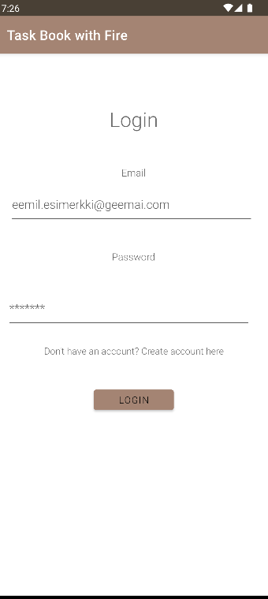
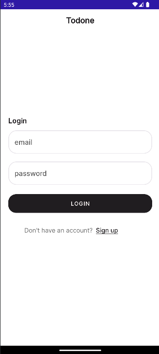
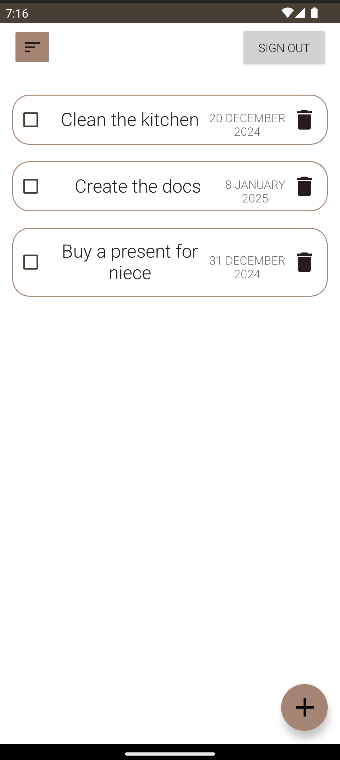
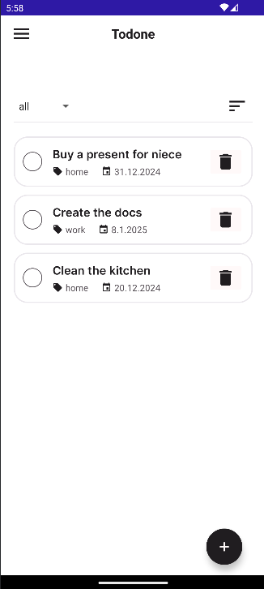
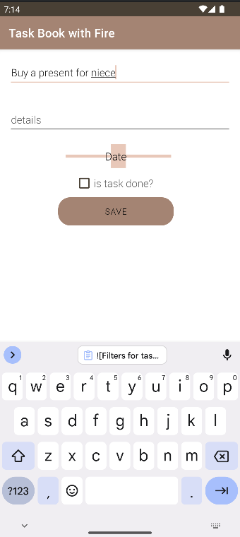
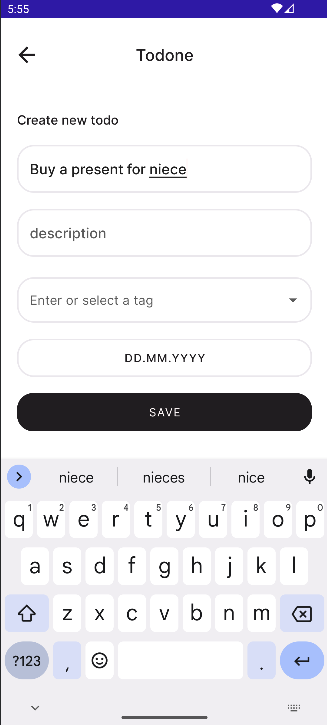
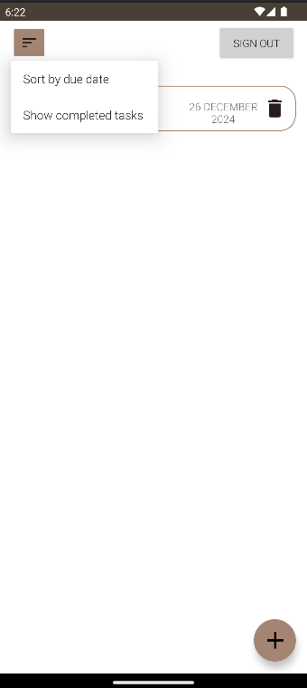
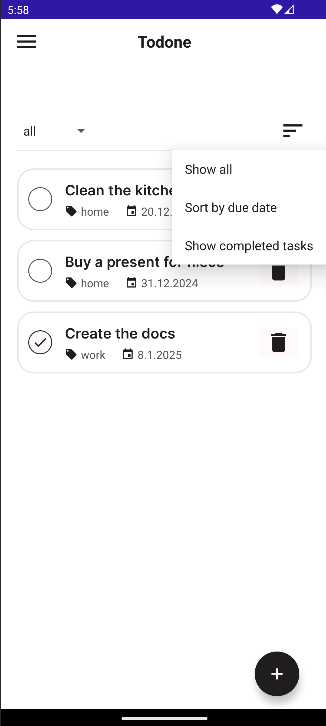
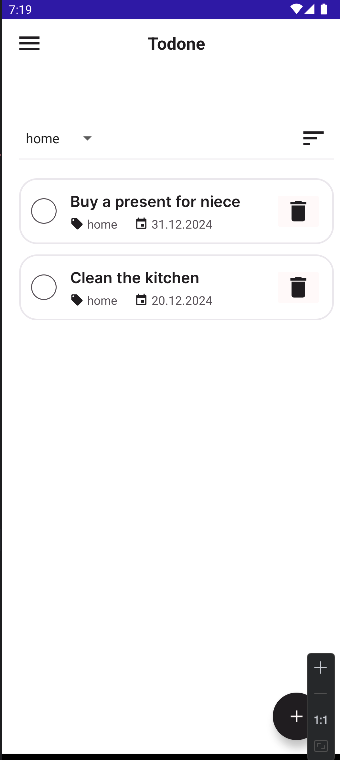

# Todone

## Table of Contents
- [Introduction](#introduction)
- [Project evolution](#project-evolution)
- [Features and Technical Stack](#features-and-technical-stack)
  - [Core Features](#core-features)
  - [Technical Implementation](#technical-implementation)
- [Setup & Installation](#setup--installation)
  - [Prerequisites](#prerequisites)
  - [Dependencies](#dependencies)
  - [Firebase setup](#firebase-setup)

## Introduction
This simple Todo app was created to practice Android development using Kotlin and Firebase. The evolution of this app reflects my learning journey in Android development. What started as a basic functional todo list transformed into a more polished application as I deepened my understanding of UI/UX principles and Android development best practices. Looking ahead, I plan to further enhance the app with additional features and optimizations.

## Project evolution

When I first started this project, my main focus was on core functionality - implementing basic Create, Read, Update, and Delete operations for tasks using Cloud Firestore. The initial design of Todone was chaotic, messy and didn't follow any logical conventions. It lacked consistency. This was due to my focus being on learning Kotlin and Android development, which is why the visual part of the project suffered a lot. After a few months, I decided to redesign Todone with the goal of creating a simple and pleasant design. In addition, I added some minor elements that I thought would bring more value to the app. Here's a side-by-side comparison showing this transformation:















New version is much more consistent and looks modern and simple. I took more things into consideration when redesigning Todone. For example, I added a tagging system and made the home page clearer. I changed the fonts and colors to create a more cohesive and user-friendly experience.

## Features and Technical Stack

### Core Features
The current version of Todone includes several core features that make it a functional and user-friendly task management app:
Core Features

User authentication system allowing secure access to personal tasks
- Create, edit (the UI needs to be modified), and delete tasks with customizable details
- Task tagging system for better organization
- Advanced filtering system:
    - Filter by tags
    - Filter by completion status (done/not done)
    - Filter by due date
    - Combined filtering (e.g., show completed tasks with specific tags, or filter tagged tasks by due date)
- Clean, modern interface with intuitive navigation
- Real-time updates and data synchronization

### Technical Implementation

Todone is built using modern Android development technologies and follows a structured project organization:

- **Frontend**: Kotlin with Android SDK
- **Backend & Database**: Firebase
    - Cloud Firestore as the primary database
        - Real-time data synchronization for instant task updates
        - Secure data storage with Firebase Authentication integration
        - Document-based data structure for flexible task management
    - Firebase Authentication for user management
        - Email and password authentication
        - Secure user sessions

- **Project Structure**:
  - ```data```: Contains data models ```(Task.kt)``` and data handling ```(TaskRepository.kt)```
  - ```ui```: User interface components
      - ```adapter```: Custom adapters for RecyclerView
      - ```screens```: Activity files for different screens
      - ```theme```: UI styling and theming
  - ```util```: Utility classes


- **UI Components**: Custom Material Design components with carefully crafted layouts in XML
- **Data Layer**:
  - TaskRepository pattern for managing Firestore operations
  - Real-time listeners for live data updates
  - CRUD operations through Firestore API

## Setup & Installation
### Prerequisites
- Android Studio latest version
- Minimum SDK: Android 8.0 (API Level 26)
- Target SDK: Android 14 (API Level 34)
- Firebase account
  
### Dependencies
This project uses the following major dependencies:
  - Firebase Services
      - Firebase Authentication
      - Cloud Firestore
  - AndroidX Components
  - Material Design Components
  - Jetpack Compose (build features enabled)

### Firebase setup

1. Create a Firebase project and add ```google-services.json``` to the app directory
2. Enable Email/Password Authentication
3. Create a Firestore database collection named tasks

### Building the project

1. Clone the repository: ```git clone https://github.com/yourusername/todone.git```
2. Open the project in Android Studio and sync Gradle files
3. Run the app on an emulator or physical device (Android 8.0 or higher)
